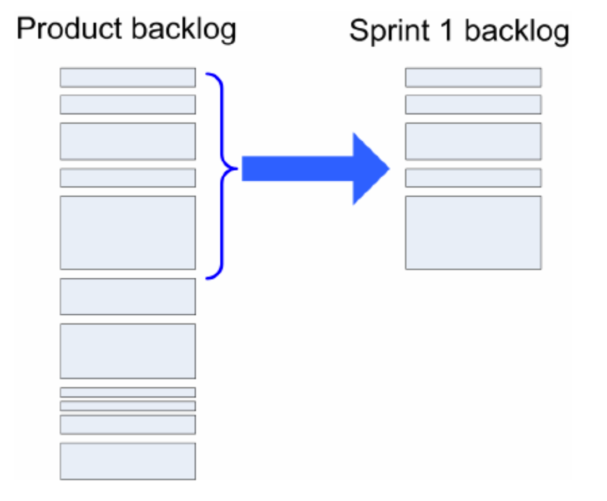
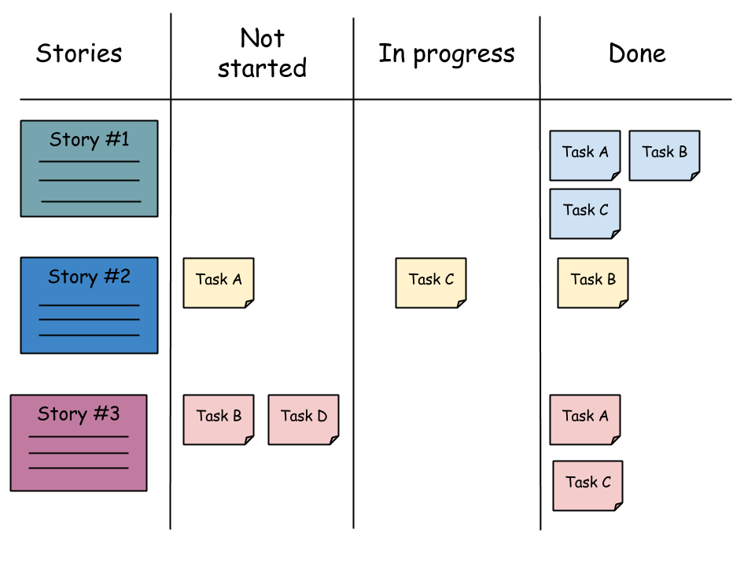

# Vaatimusmäärittely ja Scrum-backlogit

---

# Vaatimusmäärittely

- _Vaatimusmäärittely_ on ohjelmistotuontoprosessin vaihe, jossa määritellään _asiakkaan vaatimukset_ toteutettavalle ohjelmistolle
- Vaatimusmäärittelyn aikana vaatimukset selvitetään ja _dokumentoidaan_, jotta kehitystiimi voi aloittaa teknisen suunnittelun ja toteutuksen
- Ketterässä ohjelmistokehityksessä vaatimusmäärittelyä tehdään iteratiivisesti vähän kerrassaan
- Asiakas (Scrumissa tuoteomistaja) _priorisoi_ vaatimukset
- Kuhunkin iteraatioon valitaan toteutettavaksi ne vaatimukset, jotka tuovat asiakkaalle _mahdollisimman paljon liiketoiminnallista arvoa_

---

# User story

- Ketterän vaatimusmäärittelyn tärkein työväline on _käyttäjätarina_ (user story)
- Käyttäjätarinat kuvaat loppukäyttäjän kannalta _arvoa tuottavia toiminnallisuuksia_
- Käyttäjätarinat kirjoitetaan _asiakkaan ymmärtävällä kielellä_, eli ne eivät saa sisältää turhan teknistä kieltä

> ❌ Käyttäjänä voin lähettää HTTP-kutsun rekisteröitymisestä vastaavaan API-endpointtiin, joka lisää käyttäjätunnuksen ja salasanan tietokantatauluun "users" 

> ✅ Käyttäjänä voin rekisteröityä järjestelmään käyttäjätunnuksella ja salasanalla

--- 

# Hyvän käyttäjätarinan kriteerit

- Erään suositun määritelmään mukaan hyvä käyttäjätarina toteuttaa _INVEST_-kriteerit:
    - **I**ndependent: käyttäjätarina on riippumaton muista käyttäjätarinoista
    - **N**egotiable: käyttäjätarinan kuvauksessa on joustoa toteutuksen suhteen
    - **V**aluable: käyttäjätarina tuottaa arvoa
    - **E**stimable: käyttäjätarinan toteutukseen kuluva aika on määriteltävissä
    - **S**mall: käyttäjätarina on riittävän pieni
    - **T**estable: käyttäjätarinan toteutuksen toimivuus on todennettavissa

--- 

# Hyvän käyttäjätarinan kriteerit

Yleisin rike INVEST-kriteereitä kohtaan on se, että _käyttäjätarina on liian suuri_:

> ❌ Käyttäjänä voin rekisteröityä järjestelmään käyttäjätunnuksella, salasanalla, profiilikuvalla ja profiilikuvauksella

Tässä tilanteessa käyttäjätarina kannattaa _pilkkoa useaksi käyttäjätarinaksi_:

> ✅ Käyttäjänä voin rekisteröityä järjestelmään käyttäjätunnuksella ja salasanalla

> ✅ Käyttäjänä voin rekisteröitymisen yhteydessä antaa profiilikuvan

> ✅ Käyttäjänä voin rekisteröitymisen yhteydessä antaa profiilikuvauksen

---

# Product backlog

- Scrumissa _product backlog_ on tuoteomistajan priorisoima lista käyttäjätarinoita
- Product backlogin kärjessä eli korkeimmilla prioriteetilla olevat käyttäjätarinat valitaan toteutettavaksi seuraavan sprintin aikana
- Product backlogin käyttäjätarinoita lisätään, muokataan ja priorisoidaan jatkuvasti sprinttien edetessä

---

# Sprint backlog

- Product backlogilta valitaan sprintin aikana toteutettavat käyttäjätarinat sprintin tehtävälistana toimivaan _sprint backlogiin_
- Kehitystiimi valitsee product backlogin kärjestä käyttäjätarinat, jotka kokevat pystyvänsä toteuttaa sprintin aikana
- Kehitystiimi pilkkoo käyttäjätarinat teknisen tason _tehtäviksi_ (task)
- Tehtävät lisätään sprint backlogille

---

# Käyttäjätarinan pilkkominen tehtäviksi

Esimerkiksi tämän käyttäjätarinan:

> Käyttäjänä voin rekisteröityä järjestelmään käyttäjätunnuksella ja salasanalla

Voisi jakaa esimerkiksi näihin teknisiin tehtäviin:

- Kirjautumislomake, jossa on tekstikentät käyttäjätunnukselle ja salasanalle
- Tietokantaulu "users", jossa sarakkeet "username" ja "password"
- HTTP API-endpoint /api/register rekisteröitymislomakkeen lähettämiselle

---

# Sprint backlog

- Sprint backlog organisoidaan usein taulukkomaiseksi _taskboardiksi_, jossa on yksi rivi kutakin sprinttiin valittua käyttäjätarinaa kohti
- Käyttäjätarinaan liittyvät tehtävät kulkevat vasemmalta oikealle niiden tilaa kuvaavien sarakkeiden, kuten "not started", "in progress", "done" kautta

---

# Sprintin suunnittelu

- Sprintin suunnittelu -tapaamisen aikana Scrum-tiimi päivittää product backlogia tulevaa sprinttiä varten:
    - Lisää tarvittaessa uusia käyttäjätarinoita, tai muokkaa olemassaolevia
    - Priorisoi käyttäjätarinoita
- Kun product backlogin on ajantasalla, valitsee kehittäjätiimi sopivan määrän käyttäjätarinoita seuraava sprinttiä varten
- Valitut käyttäjätarinat pilkotaan kehittäjätiimin toimesta teknisiksi tehtäviksi ja tehtävät lisätään sprint backlogille
- Kehittäjätiimi sopii sprintin työnjaosta: kuka ottaa minkäkin tehtävän vastuulleen

---

# Sprintin aikana

- Sprintin aikana kehitystiimi päivittää jatkuvasti sprint backlogilla olevien tehtävien tilaa
    - Esimerkiksi kun jokin tehtävä valmistuu, tulee se siirtää "done"-tilaan
- Sprint backlogin tarkoitus on siis peilataa reaaliajassa sprintin edistymistä
- Sprint backlogia kannattaa tarkkailla aktiivisesti, etenkin kehittäjätiimin tapaamisissa